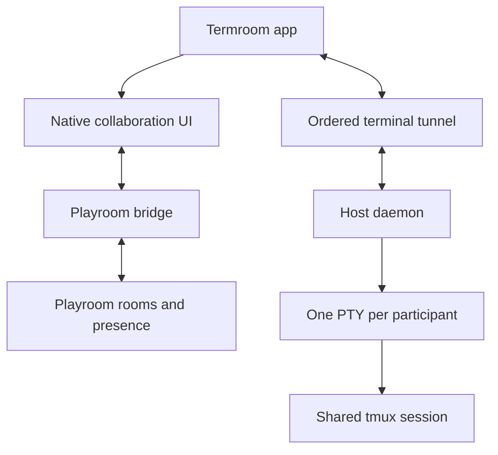

# Termroom

Termroom is a macOS-first multiplayer terminal built from Ghostty. Multiple people attach to the
same tmux session while the app renders identity, presence, roles, and remote pointers above the
terminal surface.

This branch is an initial product spike. It adds the native collaboration UI seam without changing
Ghostty's terminal parser, renderer, or PTY behavior.

## Feasibility findings

- Ghostty is MIT-licensed and explicitly supports modification and redistribution. Preserve its
  copyright and license notice in redistributed copies.
- Ghostty's macOS app is SwiftUI/AppKit over the shared Zig core. `Ghostty.SurfaceWrapper` already
  uses a `ZStack` for overlays, and `Ghostty.SurfaceView` publishes mouse coordinates. We can add
  multiplayer chrome without modifying the Metal renderer.
- tmux natively permits multiple clients on one session. Each remote user should get a separate PTY
  running `tmux attach-session`, rather than having several users share one frontend byte stream.
- Playroom Kit is a good presence plane: rooms, participant profiles, avatars, reliable shared
  state, and low-latency unreliable per-participant state are all provided. Its documented live
  cursor pattern matches this UI closely.
- Playroom is not the security, authentication, persistence, or terminal transport layer. Its own
  documentation says those remain the application's responsibility.
- Playroom currently documents JavaScript/web and Unity APIs, but not a native Swift SDK. The
  macOS adapter should therefore run the Playroom JavaScript client in an isolated `WKWebView` and
  bridge small JSON presence messages to the native SwiftUI store.

Primary references:

- [Playroom introduction](https://docs.joinplayroom.com/)
- [Playroom live cursors](https://docs.joinplayroom.com/examples/live-cursors)
- [Playroom state synchronization](https://docs.joinplayroom.com/features/apps/state)
- [Playroom with an existing stack](https://docs.joinplayroom.com/concepts/adding-playroomkit-to-your-existing-stack)
- [Ghostty repository and libghostty overview](https://github.com/ghostty-org/ghostty)
- [tmux client/session model](https://man.openbsd.org/tmux.1)

## Architecture

There are two independent data planes. Keeping terminal I/O out of Playroom is a security and
correctness requirement, not just an optimization.



### Presence plane: Playroom

Use Playroom for data that may be ephemeral:

| State | Delivery | Payload |
| --- | --- | --- |
| Pointer | Unreliable | participant ID, pane ID, normalized x/y, sequence |
| Focus | Unreliable | participant ID, active pane ID |
| Profile | Reliable | display name, avatar, accent color |
| Role display | Reliable | viewer, collaborator, driver |
| Control request | Reliable | requester ID and request ID |

Playroom's elected host must not be treated as a security authority. The host daemon separately
validates every invite, role, and input packet.

### Terminal plane: host daemon and tmux

The host daemon creates one local PTY for each participant and runs an attach command in it:

```sh
tmux attach-session -t '=termroom-<session-id>'
```

Viewer clients attach with tmux's read-only and ignore-size flags. Writable roles are still enforced
by the daemon, so changing Playroom state cannot grant terminal access.

```sh
tmux attach-session -r -t '=termroom-<session-id>'
```

The terminal protocol should be a small ordered binary WebSocket protocol for the MVP:

| Message | Direction | Purpose |
| --- | --- | --- |
| `HELLO` | guest to host | invite capability, terminal capabilities, requested role |
| `OUTPUT` | host to guest | PTY bytes with monotonically increasing sequence |
| `INPUT` | guest to host | one atomic key/paste event with sequence |
| `RESIZE` | guest to host | columns and rows; accepted only from the active driver |
| `ROLE` | host to guest | authoritative viewer/collaborator/driver role |
| `PING` | both | liveness and latency measurement |

For the first release, use **driver mode** by default: only one participant has an input lease.
An everyone-can-type mode may be added, but each key event must remain atomic so escape sequences
cannot be interleaved.

## Security invariants

1. Invite tokens are short-lived, scoped to one session, single-purpose, and revocable.
2. The host daemon is authoritative for roles and terminal input. Playroom state is presentation.
3. The relay never receives a reusable shell or SSH credential.
4. Viewers receive PTY output but their input and resize packets are rejected at the host.
5. A shared shell grants the driver all privileges of that shell. Less-trusted sessions should run
   inside a container or VM.
6. OSC clipboard, file transfer, URL opening, and notification sequences need explicit policy before
   remote sessions are considered production-safe.
7. Session recording is opt-in and visibly indicated to every participant.

## Current implementation

`macos/Sources/Features/Collaboration/CollaborationOverlay.swift` provides:

- a transport-neutral participant and cursor model;
- a session store ready for the Playroom bridge;
- a participant-count badge and stacked identity avatars;
- driver-role badges;
- labeled, color-coded remote cursors;
- conversion from AppKit coordinates to normalized top-left coordinates;
- 30 Hz outbound cursor throttling;
- a demo fixture enabled with `TERMROOM_DEMO=1`.

The overlay is mounted in Ghostty's existing `SurfaceWrapper` and does not intercept mouse input.

## Next implementation slices

1. Rebrand the macOS target, bundle identifier, app icon, and updater metadata from Ghostty to
   Termroom while preserving upstream attribution.
2. Add the isolated Playroom `WKWebView` bridge and native join/share sheet. A Playroom `gameId` is
   required for production usage.
3. Add the host daemon and ordered terminal WebSocket protocol.
4. Launch guests into separate PTYs attached to one private tmux server/socket.
5. Add authoritative driver handoff, viewer invites, kick/revoke, and invite expiry.
6. Replace normalized pointer coordinates with pane/cell-aware coordinates when clients have
   different viewport sizes or scroll positions.
7. Add a GTK overlay implementation after the macOS flow is stable.

## Local UI spike

On a macOS Ghostty development machine, build using Ghostty's documented command:

```sh
TERMROOM_DEMO=1 macos/build.nu --configuration Debug --action build
```

Launching that build with `TERMROOM_DEMO=1` displays the native collaboration fixture. A real
Playroom session will replace the fixture through `CollaborationSessionStore`.
